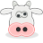

# Steeriously SFML Example

## This is an example program for using Steeriously with the SFML graphics library. 

It is provided for illustrative purposes only, no care was taken to get the
most performance, there may be bugs, but it should be enough to get you started.

More information, tutorials, and demos along with API documentation are available at [https://code.markrichards.ninja/cpp](https://code.markrichards.ninja/cpp).
